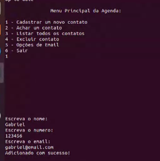
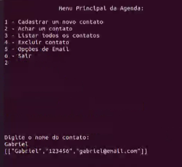
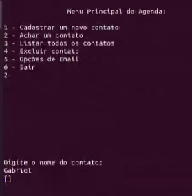
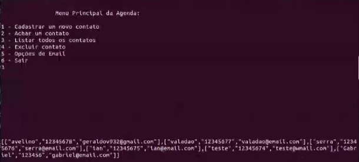

# Agenda Telefônica

**Disciplina**: FGA0210 - PARADIGMAS DE PROGRAMAÇÃO - T01 <br>
**Nro do Grupo**: 04<br>
**Paradigma**: Funcional<br>

## Alunos

| Matrícula  | Aluno                          |
| ---------- | ------------------------------ |
| 17/0103200 | Gabriel Alves Hussein          |
| 17/0011119 | Geraldo Victor Alves Barbosa   |
| 18/0102613 | Ítalo Fernandes Sales de Serra |
| 18/0103431 | João Victor Valadão de Brito   |
| 18/0020251 | João VItor Lopes de Farias     |

## Sobre

Consiste em uma agenda telefônica para registro de contatos, com nome, telefone e e-mail. Alguns das funcionalidades incluem:

- Cadastrar novo contato
- Buscar por contato
- Listar todos os contatos
- Enviar email para determinado contato

## Screenshots

<p align="center">



</p>



## Instalação

**Linguagens**: Haskell<br>
**Tecnologias**: Cabal<br>

## Instalação 

De modo a agilizar a instalação do Cabal recomendamos o uso do ```ghcup```, que já instala o ```ghc``` e ```cabal```.
Para instalar usando o ```curl``` execute no terminal o seguinte comando:

```curl --proto '=https' --tlsv1.2 -sSf https://get-ghcup.haskell.org | sh```

Em seguida para instalar o ```cabal-install``` rode o comando:

```ghcup install cabal && cabal-update```

Essa instalação permite o uso dos comandos cabal new-* que servem para instalar as dependências sem a necessidade de instalar localmente. 

## Execução

Após as instalações necessárias para rodar o projeto execute o seguinte comando na raiz do projeto:

```cabal run```

## Uso

Seguir as intruções do menu.

## Vídeo

Adicione 1 ou mais vídeos com a execução do projeto.

## Outros

O programa não funcionará corretamente caso o nome dos arquivos e/ou o local deles sejam alterados.

## Fontes

Caso utilize materiais de terceiros, referencie-os adequadamente.
